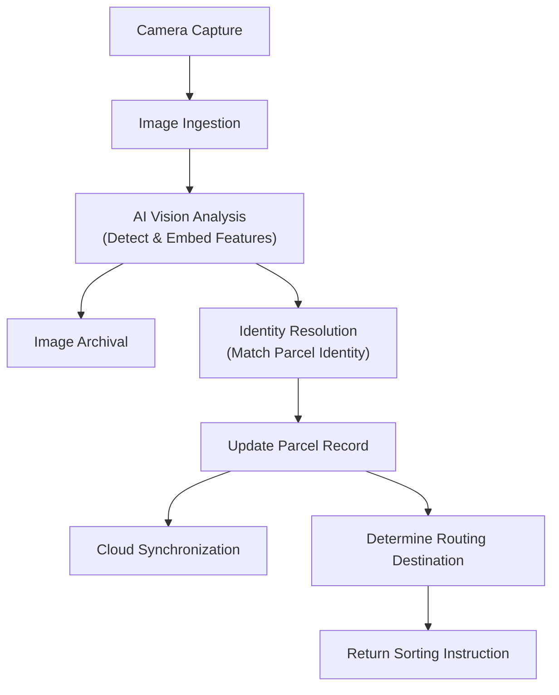
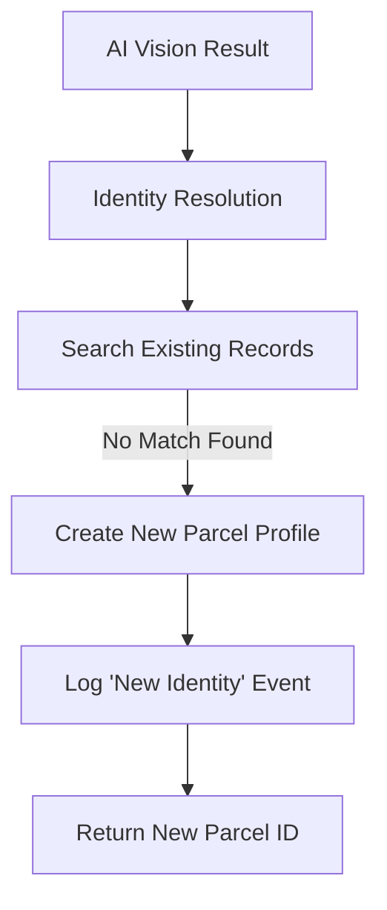
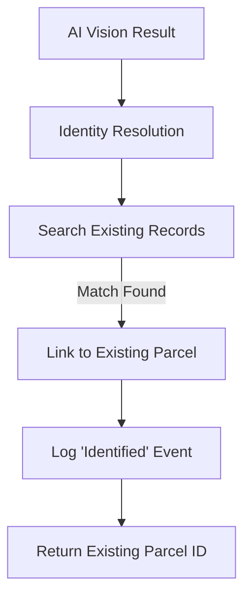
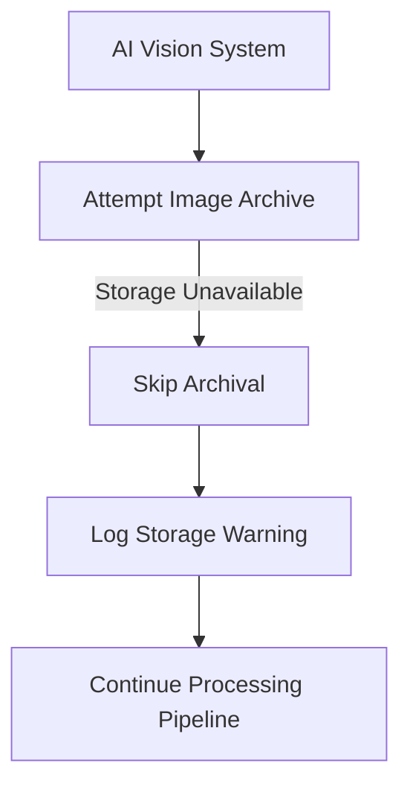
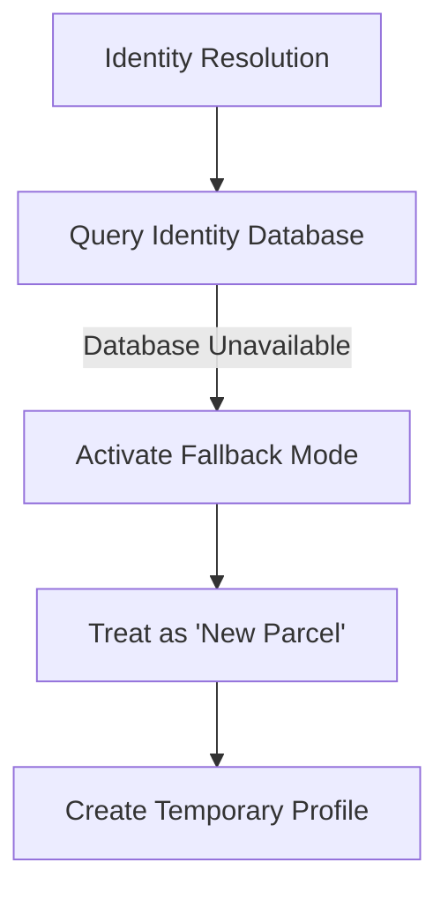
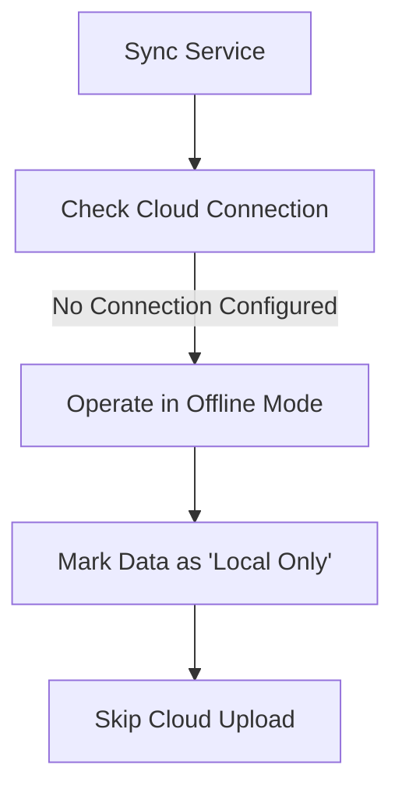
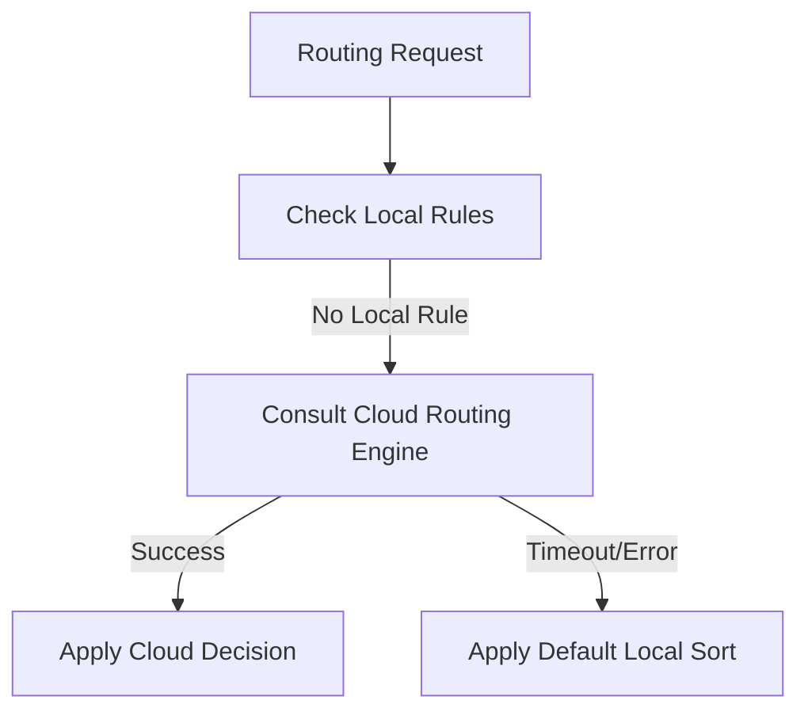
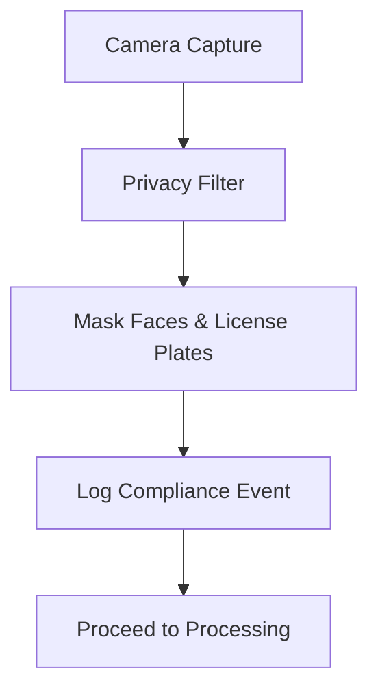
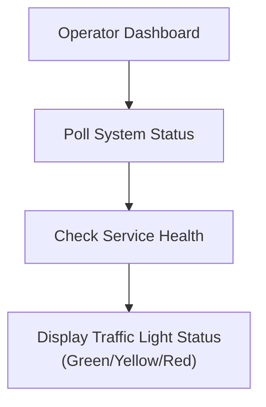

# Functional Flows (Business View)

> **Version:** 1.0.1 | **Status:** Production | **Last Updated:** 2026-03-01
> **Owner:** Edge Product Management | **Review Cadence:** Quarterly

---

## Flow 1 — Standard Parcel Processing (Happy Path)

**Use Case:** Standard identification and routing of a parcel with cloud synchronization.  
**Entry Conditions:** Parcel enters sorting area; Camera captures image.  
**Exit Conditions:** Sorting instruction returned; Data queued for cloud upload.

---

## Flow 2 — New Parcel Discovery

**Use Case:** System encounters a parcel it has never seen before.  
**Entry Conditions:** AI captures unique visual features.  
**Exit Conditions:** New digital profile created for the parcel.

---

## Flow 3 — Existing Parcel Recognition

**Use Case:** System recognizes a parcel that has been processed before.  
**Entry Conditions:** AI features match an existing record above confidence threshold.  
**Exit Conditions:** Parcel history updated with new sighting.

---

## Flow 4 — Image Archival Resilience (Business Continuity)

**Use Case:** Image storage system is down, but operations must continue.  
**Entry Conditions:** Local storage service unreachable.  
**Exit Conditions:** Parcel is processed and routed, but image is not saved (data loss accepted for uptime).

---

## Flow 5 — Identity System Resilience (Fallback Mode)

**Use Case:** Identity matching database is offline; system defaults to treating parcels as new to maintain flow.  
**Entry Conditions:** Identity database unreachable or slow.  
**Exit Conditions:** Operations continue without historical context.

---

## Flow 6 — Offline / Local-Only Operation

**Use Case:** Edge site operating without internet or cloud connection.  
**Entry Conditions:** Cloud endpoint not configured.  
**Exit Conditions:** All data remains local; no external network traffic.

---

## Flow 7 — Cloud Routing Consultation (Escalation)

**Use Case:** Local rules are insufficient; system asks cloud for complex routing decision.  
**Entry Conditions:** Routing requires external logic.  
**Exit Conditions:** Destination determined by cloud logic or fallback default.

---

## Flow 8 — Privacy Compliance Check

**Use Case:** Ensuring compliance with privacy regulations (GDPR/CCPA) during image capture.  
**Entry Conditions:** Privacy mode enabled.  
**Exit Conditions:** Only anonymized images enter the system.

---

## Flow 9 — Operational Dashboard Health Check

**Use Case:** Operator verifies system readiness before shift start.  
**Entry Conditions:** Dashboard access.  
**Exit Conditions:** Visual confirmation of system health.
