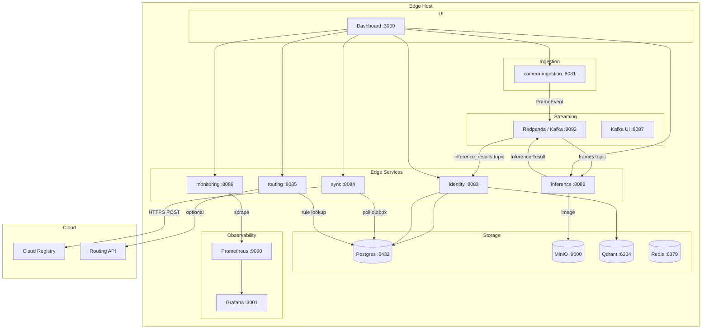

# System Architecture

> **Version:** 1.0.0 | **Status:** Production | **Last Updated:** 2026-03-01
> **Owner:** Edge Platform Engineering | **Review Cadence:** Quarterly

---

## Architecture Diagram



---

## Component Inventory

| Component | Image / Language | Port (host) | Port (container) | Role |
|-----------|-----------------|-------------|-----------------|------|
| Redpanda | `redpandadata/redpanda` | 9092 | 9092 | Kafka-compatible broker |
| Postgres | `postgres:15` | 5432 | 5432 | Relational DB |
| Redis | `redis:7` | 6379 | 6379 | Reserved (future caching / Celery) |
| MinIO | `minio/minio` | 9000 / 9001 | 9000 / 9001 | Object storage (S3-compatible) |
| Qdrant | `qdrant/qdrant` | 6334 | 6333 | Vector database |
| camera-ingestion | Go + gocv | 8081 | 8081 | Image ingestion + Kafka producer |
| edge-services (inference) | Python + ONNX | 8082 | 8082 | YOLO detection + embedding |
| edge-services (identity) | Python + aiokafka | 8083 | 8083 | Vector search + Postgres persistence |
| edge-services (sync) | Python | 8084 | 8084 | Outbox drain to cloud |
| edge-services (routing) | Python | 8085 | 8085 | Routing decisions |
| edge-services (monitoring) | Python | 8086 | 8086 | Prometheus metrics |
| ui-dashboard | Next.js | 3000 | 3000 | Operator UI |
| Prometheus | `prom/prometheus` | 9090 | 9090 | Metrics scrape + storage |
| Grafana | `grafana/grafana` | 3001 | 3000 | Dashboards |
| Kafka UI | `provectuslabs/kafka-ui` | 8087 | 8080 | Topic inspection |

---

## Key Dependencies & Libraries

| Service | Key Dependencies |
|---------|-----------------|
| camera-ingestion | Go standard library, gocv (OpenCV bindings), confluent-kafka-go |
| edge-services | Python 3.11+, aiokafka, onnxruntime, boto3, httpx, fastapi, psycopg2 |
| Qdrant client | HTTP REST via `app.vector` abstraction layer |
| MinIO client | boto3 (S3-compatible) |
| Dashboard | Next.js 14, React 18 |

---

## Data Flow (Linear)

```
Camera / POST /ingest
  → frames (Kafka)
    → Inference (ONNX detect + embed)
      → MinIO (store image)
      → inference_results (Kafka)
        → Identity (Qdrant search + Postgres write + sync_outbox)
          → Sync (poll outbox → POST to cloud)
    → Routing (POST /route → local rule | cloud API | default)
```

---

## Network Topology

### Docker Internal Network (`edge-net`)
All containers communicate on an internal Docker bridge network `edge-net`. No inter-service traffic crosses the host network.

### Host-Exposed Ports
Only necessary ports are bound to the host interface. In production, expose only:
- `:8081` (ingestion) — secured by bearer token
- `:3000` (dashboard) — secured by SSO/reverse proxy
- `:9090` (Prometheus) — internal monitoring network only
- `:3001` (Grafana) — internal monitoring network only

### Production Network Hardening
- Place a reverse proxy (nginx / Caddy) in front of all HTTP services.
- TLS termination at the reverse proxy; internal services communicate over HTTP on `edge-net`.
- Prometheus and Grafana accessible only on management VLAN.
- MinIO API (`:9000`) not exposed to host in production; accessed internally only.

---

## High Availability & Disaster Recovery

### HA Topology (Production)

| Component | HA Strategy |
|-----------|------------|
| Redpanda | 3-node cluster; replication factor 3; min ISR 2 |
| Postgres | Primary + 1 streaming replica; failover via pg_auto_failover or Patroni |
| MinIO | Distributed mode across 4 drives or 2 nodes |
| Qdrant | 2-node cluster with replication factor 2 |
| edge-services | 2 replicas per role; Kafka consumer group handles partition rebalancing |
| camera-ingestion | Stateless; 2 replicas behind load balancer |

### Recovery Objectives

| Metric | Target |
|--------|--------|
| RTO (Recovery Time Objective) | < 15 minutes |
| RPO (Recovery Point Objective) | < 5 minutes (Postgres WAL; Kafka offset) |
| MTTR (Mean Time to Repair) | < 30 minutes |

### Backup Schedule

| Data Store | Backup Frequency | Retention | Method |
|-----------|-----------------|----------|--------|
| Postgres | Hourly WAL + daily full dump | 30 days | pg_basebackup + WAL-G |
| MinIO `parcels` bucket | Daily sync to `parcels-backup` bucket | 90 days | MinIO mirror |
| Qdrant snapshots | Daily | 7 days | Qdrant snapshot API |
| Kafka offsets | Continuous (Redpanda internal) | Per topic retention | N/A |

---

## CI/CD Pipeline Overview

```
PR opened
  → Lint (ruff, golangci-lint, eslint)
  → Unit tests (pytest, go test)
  → Docker build (multi-stage; image tagged with git SHA)
  → Integration tests (docker-compose up; run test suite against live services)
  → Push image to container registry (on merge to main)
  → Deploy to staging edge host (docker-compose pull && docker-compose up -d)
  → Run P0 E2E test against staging
  → Manual approval gate
  → Deploy to production edge host
```

**Key CI tools:** GitHub Actions, Docker BuildKit, pytest, go test.

---

## Security Zones

```
[ Internet ]
     │
  [ Reverse Proxy / TLS termination ]
     │
  [ Edge API Zone ]
  │  camera-ingestion :8081
  │  ui-dashboard :3000
     │
  [ Internal Service Zone ] (edge-net; no host exposure)
  │  inference, identity, sync, routing, monitoring
  │  Redpanda, Postgres, MinIO, Qdrant, Redis
     │
  [ Observability Zone ] (management VLAN only)
     Prometheus, Grafana
```

- All inter-service communication is on `edge-net`; no external access without traversing the reverse proxy.
- Secrets injected via environment variables or Docker secrets; not baked into images.
- Container images run as non-root users.
